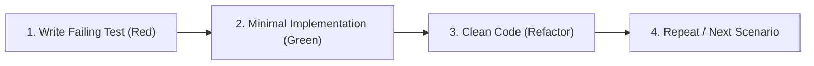

# Test-Driven Development (TDD) Guide

This skill defines the mandatory testing standards, workflows, conventions, and patterns for the Cultiva backend application.

---

## When to use

Use this skill when the user asks about:

- How to write tests for the Cultiva backend application.
- Develop a new feature, fix a bug, or change a requirement following TDD principles.

## 1. The TDD Development Flow (Red-Green-Refactor)

All feature development, bug fixes, and requirement changes must follow the strict Test-Driven Development cycle:



### Standard Workflows

1. **New Feature / Story**:
   - Read and break down requirements into explicit test scenarios.
   - Write tests first. Run the suite and verify they **fail** for the expected reason (Red).
   - Develop the minimal code (Action, DTO, Controller, Model) to make the tests pass (Green).
   - Refactor code for cleanliness, naming, and architectural alignment without breaking tests.

2. **Bug Fixes**:
   - **Never fix a bug without a test.**
   - Write a test that isolates and reproduces the bug; confirm the test fails.
   - Implement the fix until the test passes.
   - Ensure all existing tests remain green.

3. **Requirement Changes**:
   - Update or write new tests reflecting the changed requirements first.
   - Observe the test failures.
   - Adjust the implementation until all tests pass.

---

## 2. Directory Structure & Pathing Rules

### Source Path Mirroring
Tests must mirror the **exact path** where the implementation file lives in the source code, treating `tests/Unit/` or `tests/Feature/` as their new root:

$$\text{Source Path: } \texttt{<path>/<File>.php} \implies \text{Test Path: } \texttt{tests/(Unit|Feature)/<path>/<File>Test.php}$$

### Examples

| Implementation Source File | Test Type | Test File Path |
| :--- | :--- | :--- |
| `domain/Models/User/Actions/CreateUserAction.php` | **Unit** | `tests/Unit/domain/Models/User/Actions/CreateUserActionTest.php` |
| `domain/Models/User/Actions/UpdateUserAction.php` | **Unit** | `tests/Unit/domain/Models/User/Actions/UpdateUserActionTest.php` |
| `domain/Integrations/Payment/Actions/ProcessPaymentAction.php` | **Unit** | `tests/Unit/domain/Integrations/Payment/Actions/ProcessPaymentActionTest.php` |
| `domain/Integrations/Payment/Adapters/StripeAdapter.php` | **Unit** | `tests/Unit/domain/Integrations/Payment/Adapters/StripeAdapterTest.php` |
| `domain/Models/User/Http/Controllers/UserController.php` (Single flow) | **Feature** | `tests/Feature/domain/Models/User/Http/Controllers/UserControllerTest.php` |
| `domain/Models/User/Http/Controllers/UserController.php` (Multi-flow) | **Feature** | `tests/Feature/domain/Models/User/Http/Controllers/UserController/StoreTest.php`<br>`tests/Feature/domain/Models/User/Http/Controllers/UserController/IndexTest.php` |

### Fixtures Directory & Pathing
All external payloads, mocked responses, and static dataset fixtures must be stored under `tests/Fixtures/` mirroring the relevant domain, model, or integration context:

```text
tests/Fixtures/
└── Integrations/
    └── Geo/
        └── BrasilApi/
            ├── cep_v2_success.php
            └── cep_v2_error.php
```

- **File Format**: Always use `.php` files (never raw `.json` files).
- **Return Type**: Return a multiline string using heredoc (`return <<<JSON ... JSON;`).
- **Loading in Tests**: Loaded via `require base_path('tests/Fixtures/<path>.php')`.

---

## 3. Feature vs Unit Testing Boundaries

| Dimension | Feature Tests (`tests/Feature/`) | Unit Tests (`tests/Unit/`) |
| :--- | :--- | :--- |
| **Purpose** | End-to-end route/HTTP verification, client contract delivery, integrated flow | Singular unit logic, branch coverage, isolated algorithms |
| **Scope** | Complete request lifecycle (Routing, Middleware, FormRequest, Controller, Action, DB) | Single class/method (Action, Value Object/DTO, Adapter, Listener) |
| **Mocking Policy** | **Strictly minimal.** Only mock external third-party services (e.g., Stripe API, external webhooks) that cannot run in local/test environments | **Deep / Primary.** Mock external dependencies, services, notification senders, and adapters using Mockery |
| **Database** | Real test database interactions (migrations, transactions, direct factories) | In-memory / mocked wherever possible; test input $\to$ output contract |
| **When to Use** | All public API endpoints, user-facing routes, queue job triggers | Complex business rules, calculations, discrete domain actions, exceptions |

### Feature Test Non-Negotiables

- **Run the real application flow**: route, middleware, `FormRequest`, controller, Action, transformer, and database must execute normally.
- **Never mock the controller's Action**: binding a mocked Action into the container turns the test into a controller unit test and leaves business integration untested.
- **Never fake persisted state with models**: do not use `new Model`, `Factory::make()`, or `setRelation()` in Feature tests.
- **Use direct factories and persist every required relation**: call `UserFactory::new()->create()` and create related records through their factories.
- **Mock only outbound boundaries**: third-party APIs, webhooks, or equivalent services unavailable in the test environment. Do not mock application Actions, models, requests, or transformers.
- **Assert contract and side effects**: verify the response plus relevant database writes, state changes, dispatched jobs, or events.

If a test needs to mock the Action under the controller, move that scenario to `tests/Unit/`. It is not a Feature test.

> [!NOTE]
> Not all features require unit tests. If a feature is straightforward and thoroughly covered by an end-to-end Feature test, write the Feature test. Write Unit tests when business logic in an Action has multiple branching paths, calculations, or isolated failure modes that warrant targeted verification.

---

## 4. Multi-Flow Class Test Organization

When testing classes that declare multiple independent public functionalities (such as a Controller handling different routes: `login`, `register`, `forgotPassword`, `resetPassword` or CRUD operations):

- **Do NOT** lump all unrelated flows into a single monolithic test file.
- **Create a dedicated folder** named after the class at the test path.
- **Create separate test files** for each independent functionality / flow.

### Example: Controller with Multiple Routes

Source: `domain/Models/User/Http/Controllers/AuthController.php`

Test Directory: `tests/Feature/domain/Models/User/Http/Controllers/AuthController/`
- `LoginTest.php`
- `RegisterTest.php`
- `ForgotPasswordTest.php`
- `ResetPasswordTest.php`

> [!TIP]
> Only apply this sub-folder splitting to classes that obviously declare multiple truly independent flows. Classes with a single coherent flow or single-action classes use a single test file.

---

## 5. Test Structure & AAA Pattern

Every test method must explicitly follow the **Arrange, Action, Assert** pattern divided by comment headers.

### Required Sections

1. `// Arrange`: Setup initial state, create DTOs, prepare test models via direct factories.
2. `// Expects`: Setup Mockery expectations and mock return values (when mocking).
3. `// Action`: Execute the method or send the HTTP request.
4. `// Assert`: Verify return values, side effects, database assertions.
5. `// Action & Assert`: Used when the action and assertion must occur simultaneously (e.g., expecting an exception).

### Rules for Writing Test Methods

- **Subject Under Test (`$sut`)**: Whenever possible, store the instance under test in a variable named `$sut`.
- **Test Method Naming**: Must follow `test_should_<expected_behavior_in_snake_case>`:
  - `public function test_should_create_a_new_user_with_valid_data(): void`
  - `public function test_should_throw_exception_when_email_is_already_registered(): void`
  - `public function test_should_return_422_when_email_is_missing(): void`
- **Base Test Class**: All test classes must extend `Tests\TestCase` (located at `tests/TestCase.php`).
- **No Test Logic Abstraction**: Do **not** hide test setup or assertions in generic helper methods. Tests must be explicit, transparent, objective, and self-contained.
- **Datasets / Data Providers**: Use PHPUnit data providers (`#[DataProvider('...')]` or `@dataProvider`) when testing multiple input combinations.

---

## 6. Tools, Libraries, Database Factories & Fixtures

### Tools
- **Test Framework**: PHPUnit (`phpunit/phpunit`).
- **Mocking Library**: Mockery (`mockery/mockery`).

### Database Factory Instantiation
**Mandatory Rule**: Always instantiate Database Factories directly using `Factory::new()`. Never use the Model `HasFactory` trait or `Model::factory()`.

```php
// CORRECT: Direct factory instantiation
$user = UserFactory::new()->create([
    'email' => 'jane@example.com',
]);

$users = UserFactory::new()->count(3)->make();

// INCORRECT: Never use Model::factory()
// $user = User::factory()->create();
```

### Test Fixtures Convention (PHP Files with Heredoc)
**Mandatory Rule**: Never use `.json` files for fixtures. All payload fixtures must be defined as `.php` files returning a multiline string via heredoc (`<<<JSON ... JSON;`) or native arrays.

```php
// tests/Fixtures/Integrations/Geo/BrasilApi/cep_v2_success.php
<?php

return <<<JSON
{
  "cep": "89010025",
  "state": "SC",
  "city": "Blumenau",
  "neighborhood": "Centro",
  "street": "Rua Doutor Luiz de Freitas Melro",
  "service": "open-cep",
  "location": {
    "type": "Point",
    "coordinates": {
      "longitude": "-49.0629788",
      "latitude": "-26.9244749"
    }
  }
}
JSON;
```

#### Why PHP Files for Fixtures?
- **Performance**: Loaded via PHP's native `require` statement, leveraging opcode caching without runtime file I/O overhead from `file_get_contents`.
- **Flexibility**: Can return heredoc strings or PHP arrays, and supports comments or dynamic tokens if needed.
- **IDE Support**: Full PHP syntax validation and autocomplete.

#### Using Fixtures in Tests
```php
// For HTTP client fake responses (pass fixture string directly):
$fixture = require base_path('tests/Fixtures/Integrations/Geo/BrasilApi/cep_v2_success.php');

Http::fake([
    'https://brasilapi.com.br/api/cep/v2/89010025' => Http::response($fixture, 200),
]);

// When an array is required (decode string to array):
$fixture = require base_path('tests/Fixtures/Integrations/Geo/BrasilApi/cep_v2_success.php');
$payload = json_decode($fixture, true);
```

---

## 7. Assertions & Array Comparisons

- Assert what makes sense according to the behavior being tested.
- **Canonical Array Assertions**: When asserting arrays, always use `assertEqualsCanonicalizing` (or `$this->assertEqualsCanonicalizing(...)`) unless element ordering is specifically relevant to the business logic.

```php
// When asserting arrays without strict order requirements:
$this->assertEqualsCanonicalizing(
    ['admin', 'editor'],
    $roles
);
```

---

## 8. Complete Project-Aligned Code Examples

All examples below strictly follow the project's **Action Pattern** (`Cultiva\Models\<Entity>\Actions\<Verb><Noun>Action`), **DTO Pattern** (`<Noun>DTO::from(...)`), custom **Domain Exceptions**, and **Controller DI**.

### Example 1: Unit Test for an Action (with Mockery, `$sut`, and `// Expects`)

Implementation Under Test:
```php
// domain/Models/User/Actions/CreateUserAction.php
namespace Cultiva\Models\User\Actions;

use Cultiva\Models\User\DTO\UserDTO;
use Cultiva\Models\User\Events\UserCreated;
use Cultiva\Models\User\Exceptions\UserAlreadyExistsException;
use Cultiva\Models\User\User;
use Cultiva\Integrations\Notification\Contracts\NotificationService;

class CreateUserAction
{
    public function __construct(
        private NotificationService $notifications
    ) {}

    public function execute(UserDTO $data): User
    {
        $this->validateBusinessRules($data);

        $user = User::create((array) $data);
        $this->notifications->sendWelcome($user->email);
        event(new UserCreated($user));

        return $user;
    }

    private function validateBusinessRules(UserDTO $data): void
    {
        if (User::where('email', $data->email)->exists()) {
            throw new UserAlreadyExistsException('Email already registered');
        }
    }
}
```

Unit Test File (`tests/Unit/domain/Models/User/Actions/CreateUserActionTest.php`):
```php
<?php

namespace Tests\Unit\domain\Models\User\Actions;

use Cultiva\Integrations\Notification\Contracts\NotificationService;
use Cultiva\Models\User\Actions\CreateUserAction;
use Cultiva\Models\User\DTO\UserDTO;
use Cultiva\Models\User\Events\UserCreated;
use Cultiva\Models\User\User;
use Illuminate\Foundation\Testing\RefreshDatabase;
use Illuminate\Support\Facades\Event;
use Mockery;
use Mockery\MockInterface;
use Tests\TestCase;

class CreateUserActionTest extends TestCase
{
    use RefreshDatabase;

    public function test_should_create_user_and_dispatch_event_successfully(): void
    {
        // Arrange
        Event::fake([UserCreated::class]);

        $dto = UserDTO::from([
            'name'     => 'Jane Doe',
            'email'    => 'jane@example.com',
            'password' => 'secret123',
        ]);

        // Expects
        $notificationMock = Mockery::mock(NotificationService::class, function (MockInterface $mock) use ($dto) {
            $mock->shouldReceive('sendWelcome')
                ->once()
                ->with($dto->email);
        });

        $sut = new CreateUserAction($notificationMock);

        // Action
        $result = $sut->execute($dto);

        // Assert
        $this->assertInstanceOf(User::class, $result);
        $this->assertSame('jane@example.com', $result->email);
        $this->assertDatabaseHas('users', ['email' => 'jane@example.com']);
        Event::assertDispatched(UserCreated::class);
    }
}
```

---

### Example 2: Unit Test with `// Action & Assert` (Exception Handling)

Unit Test File (`tests/Unit/domain/Models/User/Actions/CreateUserActionExceptionTest.php`):
```php
<?php

namespace Tests\Unit\domain\Models\User\Actions;

use Cultiva\Integrations\Notification\Contracts\NotificationService;
use Cultiva\Models\User\Actions\CreateUserAction;
use Cultiva\Models\User\DTO\UserDTO;
use Cultiva\Models\User\Exceptions\UserAlreadyExistsException;
use Database\Factories\UserFactory;
use Illuminate\Foundation\Testing\RefreshDatabase;
use Mockery;
use Tests\TestCase;

class CreateUserActionExceptionTest extends TestCase
{
    use RefreshDatabase;

    public function test_should_throw_exception_when_email_already_exists(): void
    {
        // Arrange
        UserFactory::new()->create(['email' => 'duplicate@example.com']);

        $dto = UserDTO::from([
            'name'     => 'Duplicate User',
            'email'    => 'duplicate@example.com',
            'password' => 'secret123',
        ]);

        $notificationMock = Mockery::mock(NotificationService::class);
        $sut = new CreateUserAction($notificationMock);

        // Action & Assert
        $this->expectException(UserAlreadyExistsException::class);
        $sut->execute($dto);
    }
}
```

---

### Example 3: Feature Test with Multi-Flow Controller Splitting & Direct Factory

Implementation Controller:
```php
// domain/Models/User/Http/Controllers/UserController.php
namespace Cultiva\Models\User\Http\Controllers;

use Cultiva\Base\Contracts\Controller;
use Cultiva\Models\User\Actions\CreateUserAction;
use Cultiva\Models\User\DTO\UserDTO;
use Cultiva\Models\User\Http\Requests\StoreUserRequest;
use Illuminate\Http\JsonResponse;

class UserController extends Controller
{
    public function store(StoreUserRequest $request, CreateUserAction $action): JsonResponse
    {
        $dto = UserDTO::from($request->validated());
        $user = $action->execute($dto);

        return response()->json([
            'data' => [
                'id'    => $user->id,
                'name'  => $user->name,
                'email' => $user->email,
            ],
        ], 201);
    }
}
```

Feature Test File (`tests/Feature/domain/Models/User/Http/Controllers/UserController/StoreTest.php`):
```php
<?php

namespace Tests\Feature\domain\Models\User\Http\Controllers\UserController;

use Database\Factories\UserFactory;
use Illuminate\Foundation\Testing\RefreshDatabase;
use Tests\TestCase;

class StoreTest extends TestCase
{
    use RefreshDatabase;

    public function test_should_create_user_and_return_201_when_valid_payload(): void
    {
        // Arrange
        $payload = [
            'name'     => 'John Doe',
            'email'    => 'john@example.com',
            'password' => 'secret123',
        ];

        // Action
        $response = $this->postJson('/api/v1/users', $payload);

        // Assert
        $response->assertStatus(201)
            ->assertJson([
                'data' => [
                    'name'  => 'John Doe',
                    'email' => 'john@example.com',
                ],
            ]);

        $this->assertDatabaseHas('users', ['email' => 'john@example.com']);
    }

    public function test_should_return_422_when_email_already_exists(): void
    {
        // Arrange
        UserFactory::new()->create(['email' => 'john@example.com']);

        $payload = [
            'name'     => 'John Doe',
            'email'    => 'john@example.com',
            'password' => 'secret123',
        ];

        // Action
        $response = $this->postJson('/api/v1/users', $payload);

        // Assert
        $response->assertStatus(422)
            ->assertJsonValidationErrors(['email']);
    }
}
```

---

### Example 4: Parameterized Dataset Test (Data Provider)

Unit Test File (`tests/Unit/domain/Models/User/DTO/UserDTOTest.php`):
```php
<?php

namespace Tests\Unit\domain\Models\User\DTO;

use Cultiva\Models\User\DTO\UserDTO;
use PHPUnit\Framework\Attributes\DataProvider;
use Tests\TestCase;

class UserDTOTest extends TestCase
{
    #[DataProvider('invalidEmailDataProvider')]
    public function test_should_throw_invalid_argument_exception_for_invalid_email_format(string $invalidEmail): void
    {
        // Arrange
        $payload = [
            'name'     => 'Test User',
            'email'    => $invalidEmail,
            'password' => 'secret123',
        ];

        // Action & Assert
        $this->expectException(\InvalidArgumentException::class);
        UserDTO::from($payload);
    }

    public static function invalidEmailDataProvider(): array
    {
        return [
            'missing @ symbol'    => ['invalid-email.com'],
            'missing domain'      => ['user@'],
            'missing top level'   => ['user@domain'],
            'empty string email'  => [''],
        ];
    }
}
```

---

### Example 5: Integration Provider Test with PHP Fixtures & HTTP Mocking

Integration Provider Test File (`tests/Unit/domain/Integrations/Geo/Provider/BrasilApi/BrasilApiGeoProviderTest.php`):
```php
<?php

namespace Tests\Unit\domain\Integrations\Geo\Provider\BrasilApi;

use Cultiva\Base\ValueObjects\Cep;
use Cultiva\Integrations\Geo\DTO\GeoAddressDTO;
use Cultiva\Integrations\Geo\Exceptions\GeoException;
use Cultiva\Integrations\Geo\Provider\BrasilApi\BrasilApiGeoProvider;
use Illuminate\Support\Facades\Http;
use Tests\TestCase;

class BrasilApiGeoProviderTest extends TestCase
{
    public function test_should_return_geo_address_dto_when_brasil_api_returns_successful_response(): void
    {
        // Arrange
        $fixture = require base_path('tests/Fixtures/Integrations/Geo/BrasilApi/cep_v2_success.php');

        Http::fake([
            'https://brasilapi.com.br/api/cep/v2/89010025' => Http::response($fixture, 200),
        ]);

        $cep = new Cep('89010-025');
        $sut = $this->app->make(BrasilApiGeoProvider::class);

        // Action
        $result = $sut->searchByCep($cep);

        // Assert
        $this->assertInstanceOf(GeoAddressDTO::class, $result);
        $this->assertSame('89010025', $result->zipCode);
        $this->assertSame('SC', $result->state);
        $this->assertSame('Blumenau', $result->city);
        $this->assertSame('Centro', $result->neighborhood);
        $this->assertSame('Rua Doutor Luiz de Freitas Melro', $result->street);
        $this->assertSame(-26.9244749, $result->latitude);
        $this->assertSame(-49.0629788, $result->longitude);
    }
}
```

---

## 9. Summary Checklist for Every Test

Before committing tests or considering a task done, verify against this checklist:

- [ ] **Pathing**: Test file path mirrors source file under `tests/Unit/` or `tests/Feature/`.
- [ ] **Granularity**: Multi-route classes are split into dedicated test files in a named directory.
- [ ] **Base Class**: Class extends `Tests\TestCase`.
- [ ] **Naming**: Methods named `test_should_<behavior_in_snake_case>`.
- [ ] **AAA Structure**: Explicit `// Arrange`, `// Expects`, `// Action`, `// Assert` (or `// Action & Assert`) comments.
- [ ] **SUT Variable**: Subject under test stored in `$sut`.
- [ ] **Factory Usage**: Direct `Factory::new()->create(...)` / `Factory::new()->make(...)` used (no `Model::factory()`).
- [ ] **Feature Flow**: Feature tests use real Actions, requests, transformers, and database state without application-layer mocks.
- [ ] **Feature State**: Feature test models and relations are persisted with direct `Factory::new()->create(...)` calls, never `new Model`, `make()`, or `setRelation()`.
- [ ] **Mock Boundary**: Feature mocks/fakes are limited to outbound third-party boundaries.
- [ ] **Side Effects**: Feature tests assert relevant database or asynchronous side effects in addition to the HTTP response.
- [ ] **Fixtures**: Stored in `tests/Fixtures/` as `.php` files returning multiline strings (heredoc `<<<JSON ... JSON;`), loaded via `require base_path(...)`.
- [ ] **Array Assertions**: Uses `assertEqualsCanonicalizing` for unordered array checks.
- [ ] **Independence**: Tests are self-contained without hidden abstraction helpers.
- [ ] **Action Pattern**: Follows single `execute()` method with DTO input and typed return.
