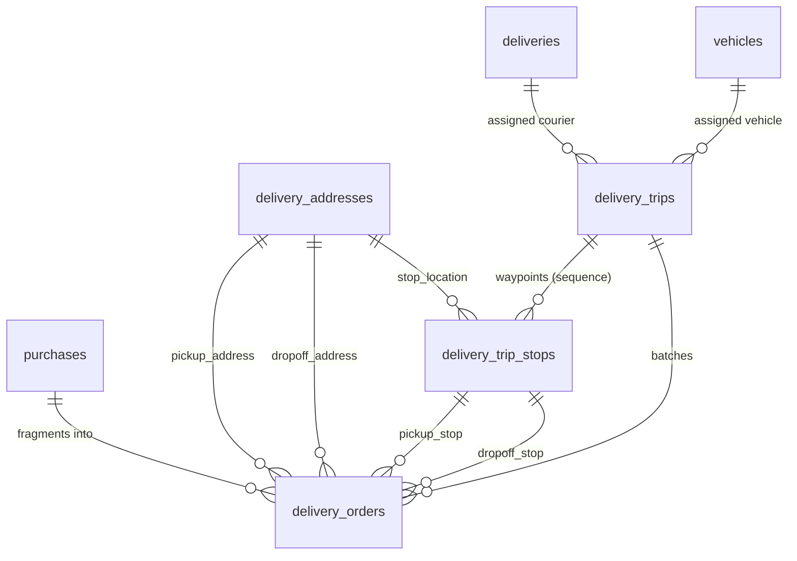

# Delivery Orders & Trips Architecture

## 1. Domain Entities & Roles

To eliminate domain ambiguity and support multi-producer, multi-retailer logistics, the delivery domain is structured around four primary entities:

1. **`Delivery` (Existing: `deliveries` table):**
   - Represents the **Courier / Driver profile** (e.g. CNH document, category, belonging to a company/user).
2. **`Vehicle` (Existing: `vehicles` table):**
   - Represents the courier's vehicle and its refrigeration capability (`cargo_type`: `dry`, `climate_controlled`, `refrigerated`).
3. **`DeliveryAddress` (`delivery_addresses` table):**
   - Dedicated, immutable textual and geospatial snapshot of origin and destination addresses at the moment a delivery is planned.
   - Preserves historical coordinates and street data even if a producer or retailer later changes their profile address.
4. **`DeliveryTrip` (`delivery_trips` table):**
   - Represents an executable journey/run.
   - Assigned to a specific courier (`delivery_id`) and vehicle (`vehicle_id`).
   - Progresses through lifecycle states: `available` $\to$ `assigned` $\to$ `in_progress` $\to$ `completed` / `cancelled`.
5. **`DeliveryTripStop` (`delivery_trip_stops` table):**
   - Waypoints along a trip executed in a defined order (`sequence`: 1, 2, 3...).
   - Each stop represents a physical visit to a `delivery_address` for either a `pickup` or a `dropoff`.
   - Tracks arrival, completion, and operational notes.
6. **`DeliveryOrder` (`delivery_orders` table):**
   - The cargo unit to be transported, originating from a `Purchase`.
   - Can exist independently of trips (`trip_id = null`) when waiting to be batched or if reassigned after a trip cancellation.
   - Links to its pickup waypoint (`pickup_stop_id`) and dropoff waypoint (`dropoff_stop_id`).
   - Tracks operational status: `pending` $\to$ `assigned` $\to$ `in_transit` $\to$ `delivered` / `failed` / `cancelled`.
   - Records execution timestamps: `picked_up_at`, `delivered_at`, `failed_at`, `cancelled_at`.

---

## 2. Entity Relationship Diagram

---

## 3. Operational Lifecycle

### Phase 1: Purchase Creation (Decoupled Order)
- When a retailer purchases from an offer, a `Purchase` record is created.
- The producer's and retailer's addresses are snapshotted into `delivery_addresses`.
- An initial `DeliveryOrder` is created with the full purchase quantity:
  - `status = 'pending'`
  - `trip_id = null`, `pickup_stop_id = null`, `dropoff_stop_id = null`.

### Phase 2: Route Generation & Pre-splitting
- The splitting routine evaluates pending orders and nearby vehicle capabilities.
- If an order's quantity exceeds vehicle capacity, it is fragmented into multiple `delivery_orders` pointing to the same `purchase_id`.
- The system generates a `DeliveryTrip` (`status = 'available'`) with ordered `DeliveryTripStop` waypoints:
  - Stop 1: Pickup at Producer A (Sequence 1)
  - Stop 2: Pickup at Producer B (Sequence 2)
  - Stop 3: Dropoff at Retailer X (Sequence 3)
  - Stop 4: Dropoff at Retailer Y (Sequence 4)
- Orders are attached to the trip:
  - `trip_id = trip.id`
  - `pickup_stop_id = stop_1.id`
  - `dropoff_stop_id = stop_3.id`
  - `status = 'assigned'`.

### Phase 3: Driver Claiming & Execution
- An available courier claims the trip.
- `delivery_trips` updates: `delivery_id = driver.id`, `vehicle_id = vehicle.id`, `status = 'assigned'`.
- Courier begins route $\to$ Trip `status = 'in_progress'`, `started_at = now()`.
- At each stop:
  - Stop 1: Courier loads Order 1 and Order 2 $\to$ Orders updated to `status = 'in_transit'`, `picked_up_at = now()`. Stop 1 updated to `status = 'completed'`.
  - Stop 3: Courier delivers Order 1 $\to$ Order 1 updated to `status = 'delivered'`, `delivered_at = now()`. Stop 3 updated to `status = 'completed'`.
- When all stops finish $\to$ Trip `status = 'completed'`, `completed_at = now()`.

### Phase 4: Partial Failure & Recovery
- If a dropoff fails (e.g. store closed, goods rejected):
  - That specific `DeliveryOrder` updates to `status = 'failed'`, `failed_at = now()`.
  - Other orders in the trip continue normally to `delivered`.
  - The trip itself completes cleanly as `completed`.
- If a courier aborts/cancels before pickup:
  - Trip updates to `status = 'cancelled'`.
  - Orders are reset to `trip_id = null`, `pickup_stop_id = null`, `dropoff_stop_id = null`, `status = 'pending'`.
  - Orders seamlessly return to the pool for another trip without affecting the parent `Purchase`.

---

## 4. Database Schema Specifications

### `delivery_addresses`
| Column | Type | Constraints / Description |
| :--- | :--- | :--- |
| `id` | bigserial | Primary Key |
| `zip` | varchar(8) | Postal code |
| `street` | varchar(100) | Street name |
| `number` | varchar(20) | House/building number |
| `complement` | varchar(50) | Nullable |
| `reference_point` | varchar(150) | Nullable |
| `neighborhood` | varchar(50) | Neighborhood name |
| `city` | varchar(50) | City name |
| `state` | varchar(2) | State UF code |
| `coordinate` | geography(Point, 4326) | Nullable PostGIS geographic point |
| `created_at`, `updated_at` | timestamp | Standard timestamps |

### `delivery_trips`
| Column | Type | Constraints / Description |
| :--- | :--- | :--- |
| `id` | bigserial | Primary Key |
| `delivery_id` | foreignId | Nullable $\to$ `deliveries(id)`, `nullOnDelete` |
| `vehicle_id` | foreignId | Nullable $\to$ `vehicles(id)`, `nullOnDelete` |
| `status` | varchar(20) | Default: `'available'`. Check: `available`, `assigned`, `in_progress`, `completed`, `cancelled` |
| `started_at` | timestamp | Nullable when trip begins |
| `completed_at` | timestamp | Nullable when trip ends |
| `cancelled_at` | timestamp | Nullable if trip is cancelled |
| `created_at`, `updated_at` | timestamp | Standard timestamps |

### `delivery_trip_stops`
| Column | Type | Constraints / Description |
| :--- | :--- | :--- |
| `id` | bigserial | Primary Key |
| `trip_id` | foreignId | $\to$ `delivery_trips(id)`, `cascadeOnDelete` |
| `delivery_address_id` | foreignId | $\to$ `delivery_addresses(id)`, `restrictOnDelete` |
| `sequence` | integer | Check: `sequence > 0`. Unique per `['trip_id', 'sequence']` |
| `stop_type` | varchar(10) | Check: `pickup`, `dropoff` |
| `status` | varchar(20) | Default: `'pending'`. Check: `pending`, `arrived`, `completed`, `skipped` |
| `arrived_at` | timestamp | Nullable |
| `completed_at` | timestamp | Nullable |
| `notes` | text | Nullable operational notes |
| `created_at`, `updated_at` | timestamp | Standard timestamps |

### `delivery_orders`
| Column | Type | Constraints / Description |
| :--- | :--- | :--- |
| `id` | bigserial | Primary Key |
| `purchase_id` | foreignId | $\to$ `purchases(id)`, `restrictOnDelete` |
| `trip_id` | foreignId | Nullable $\to$ `delivery_trips(id)`, `nullOnDelete` |
| `pickup_stop_id` | foreignId | Nullable $\to$ `delivery_trip_stops(id)`, `nullOnDelete` |
| `dropoff_stop_id` | foreignId | Nullable $\to$ `delivery_trip_stops(id)`, `nullOnDelete` |
| `pickup_address_id` | foreignId | $\to$ `delivery_addresses(id)`, `restrictOnDelete` |
| `dropoff_address_id` | foreignId | $\to$ `delivery_addresses(id)`, `restrictOnDelete` |
| `quantity` | integer | Check: `quantity > 0` |
| `status` | varchar(20) | Default: `'pending'`. Check: `pending`, `assigned`, `in_transit`, `delivered`, `failed`, `cancelled` |
| `picked_up_at` | timestamp | Nullable |
| `delivered_at` | timestamp | Nullable |
| `failed_at` | timestamp | Nullable |
| `cancelled_at` | timestamp | Nullable |
| `created_at`, `updated_at` | timestamp | Standard timestamps |
