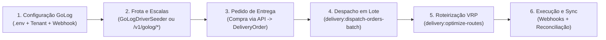

# Integração Cultiva ↔ GoLog TMS — Arquitetura e Guia de Uso

Este guia explica como funciona a integração entre o backend do Cultiva e a API da **GoLog TMS**, como configurá-la para uso, como operar o ciclo completo de entregas e como testá-la com os dados gerados pelo ambiente de demonstração.


```mermaid
flowchart LR
    A["1. Configuração GoLog\n(.env + Tenant + Webhook)"] --> B["2. Frota e Escalas\n(GoLogDriverSeeder ou /v1/golog/*)"]
    B --> C["3. Pedido de Entrega\n(Compra via API -> DeliveryOrder)"]
    C --> D["4. Despacho em Lote\n(delivery:dispatch-orders-batch)"]
    D --> E["5. Roteirização VRP\n(delivery:optimize-routes)"]
    E --> F["6. Execução e Sync\n(Webhooks + Reconciliação)"]
```

---

## 1. Visão Geral da Arquitetura

| Componente | Responsabilidade | Implementação |
| :--- | :--- | :--- |
| **Cliente HTTP e Sessão** | Autentica na GoLog (`POST /login`), armazena a sessão em cache Redis (`golog_auth_session`, TTL `6600s`) e envia `Authorization: Bearer` + `X-Tenant-Id` obrigatório em toda requisição autenticada. | [`GoLogClient`](../domain/Integrations/GoLog/Clients/GoLogClient.php), [`Config`](../domain/Integrations/GoLog/Config.php) |
| **Provisionamento de Frota** | Cadastra motorista e veículo em etapas (`user` → `driver` → `tractor` → `equipament_group`) até `isProvisioned() === true`. Escalas diárias (`workSchedule`) são consultadas diretamente na GoLog na roteirização (sem persistência local de `golog_work_schedule_id`). | [`GoLogDriverController`](../domain/Integrations/GoLog/Http/Controllers/GoLogDriverController.php), [`GoLogDriver`](../domain/Models/Delivery/GoLogDriver.php) |
| **Despacho em Lote** | Agrupa `delivery_orders` `pending` sem shipments por categoria, resolve o tipo de transporte (`REFRIGERADO`, `CLIMATIZADO`, `CARGA SECA`), seleciona via [`ResolveAvailableWorkSchedulesAction`](../domain/Integrations/GoLog/Actions/ResolveAvailableWorkSchedulesAction.php) a menor data com escalas `ATIVO` dos motoristas provisionados a partir do próximo dia útil em `America/Sao_Paulo`, envia `POST /integration/invoices/json` e cria 2 [`GoLogShipment`](../domain/Models/DeliveryOrder/GoLogShipment.php) (`COLETA` e `ENTREGA`) com status `PENDENTE`. | [`DispatchDeliveryOrdersBatchAction`](../domain/Integrations/GoLog/Actions/DispatchDeliveryOrdersBatchAction.php) |
| **Roteirização (VRP)** | Coleta shipments `PENDENTE` e obtém via [`ResolveAvailableWorkSchedulesAction`](../domain/Integrations/GoLog/Actions/ResolveAvailableWorkSchedulesAction.php) as escalas `ATIVO` na GoLog para a mesma menor data disponível; chama `POST /api-route-optimization` (`routePriority: TEMPO`) e transiciona os shipments aceitos para `AGUARDANDO_INICIO` e os [`DeliveryOrder`](../domain/Models/DeliveryOrder/DeliveryOrder.php) para `assigned`. | [`OptimizeDeliveryRoutesAction`](../domain/Integrations/GoLog/Actions/OptimizeDeliveryRoutesAction.php) |
| **Webhooks e Reconciliação** | Recebe eventos assinados (`HMAC-SHA256`), persiste idempotentemente em `golog_webhook_events` com lock no Redis e processa em fila (Horizon), atualizando [`GoLogShipment`](../domain/Models/DeliveryOrder/GoLogShipment.php) e [`DeliveryOrder`](../domain/Models/DeliveryOrder/DeliveryOrder.php) sob `lockForUpdate()`. | [`GoLogWebhookController`](../domain/Integrations/GoLog/Http/Controllers/GoLogWebhookController.php), [`SyncGoLogShipmentStatusAction`](../domain/Integrations/GoLog/Actions/SyncGoLogShipmentStatusAction.php), [`ReconcileGoLogShipmentsAction`](../domain/Integrations/GoLog/Actions/ReconcileGoLogShipmentsAction.php) |

---

## 2. Configuração da Integração GoLog

### 2.1. Variáveis GoLog no `.env`

Configure no `backend/.env` os parâmetros específicos da GoLog (referenciados em [`config/services.php`](../config/services.php)):

```dotenv
GOLOG_BASE_URL=http://147.15.18.21:8081
GOLOG_EMAIL=cultiva@cultiva.com
GOLOG_PASSWORD="<senha_admin_golog>"
GOLOG_TENANT_ID=5647b3d4-f42f-4905-a617-896afa8dccef
GOLOG_TIMEOUT=60
GOLOG_WEBHOOK_SECRET="<seu_segredo_hmac>"
```

- `GOLOG_TENANT_ID` é **obrigatório**: toda requisição autenticada envia o header `X-Tenant-Id`.
- O cliente usa o cache Redis configurado na aplicação (`golog_auth_session`), e o consumo de webhooks depende da fila sendo processada pelo Horizon (`worker`).

> **Observação de segurança:** nunca versione senhas reais ou segredos HMAC no repositório.

### 2.2. Tenant e Tipos de Transporte

#### Opção A — Reusar o Tenant Compartilhado da Cultiva (Recomendado)

Mantenha `GOLOG_TENANT_ID=5647b3d4-f42f-4905-a617-896afa8dccef` no `.env` (já pré-configurado em [`collection/bruno/environments/local.yml`](../collection/bruno/environments/local.yml)). Esse tenant já possui:
- Os 3 tipos de transporte esperados pelo Cultiva (`CARGA SECA`, `CLIMATIZADO`, `REFRIGERADO`)
- Perfil padrão de otimização VRP
- Os 3 motoristas/veículos pré-provisionados que correspondem ao [`GoLogDriverSeeder`](../database/seeders/GoLogDriverSeeder.php)

Para conferir ou garantir os tipos de transporte no tenant configurado:

```bash
docker compose exec php php artisan golog:populate-transport-types
```

#### Opção B — Utilizar um Novo Tenant na GoLog

1. Na collection Bruno em `backend/collection/bruno` (ambiente `local`), autentique com [`GoLog TMS/01. Auth & Setup/01. Login.yml`](../collection/bruno/GoLog%20TMS/01.%20Auth%20%26%20Setup/01.%20Login.yml) e crie o tenant com [`GoLog TMS/01. Auth & Setup/08. Create Cultiva Tenant.yml`](../collection/bruno/GoLog%20TMS/01.%20Auth%20%26%20Setup/08.%20Create%20Cultiva%20Tenant.yml).
2. Atualize `GOLOG_TENANT_ID` (e, se necessário, `GOLOG_EMAIL`/`GOLOG_PASSWORD`) no `.env`, limpe o cache do token anterior no Redis e cadastre os tipos de transporte:

   ```bash
   docker compose exec php php artisan cache:forget golog_auth_session
   docker compose exec php php artisan golog:populate-transport-types
   ```

3. Crie um perfil padrão de otimização para o novo tenant na GoLog (`POST /optimization-profile` com `"companyId": "<GOLOG_TENANT_ID>"` e `"isDefault": true`).

### 2.3. Registro de Webhook Público (ngrok / HTTPS)

Para receber eventos em tempo real em `POST /v1/golog/webhook`:

1. Exponha a API local por uma URL pública HTTPS (ex.: `ngrok http 80`).
2. Defina `GOLOG_WEBHOOK_SECRET` no `.env` e registre a URL na GoLog usando [`ConfigureGoLogWebhookCommand`](../domain/Integrations/GoLog/Commands/ConfigureGoLogWebhookCommand.php):

   ```bash
   docker compose exec php php artisan golog:configure-webhook "https://<seu-subdominio>.ngrok-free.app/v1/golog/webhook" --test
   ```

   - Opções disponíveis: `--secret=<segredo>` (sobrescreve `GOLOG_WEBHOOK_SECRET`), `--inactive` (registra inativo) e `--test` (dispara `POST company/{tenantId}/webhook/test` com evento `TEST_PING`).
   - O endpoint valida `X-GoLog-Signature` (`sha256=<hmac>`), `X-GoLog-Delivery` (UUID idempotente) e `X-GoLog-Event`, e exige o processador de fila ativo para executar os jobs enfileirados.

---

## 3. Frota, Motoristas e Escalas de Trabalho

Um [`GoLogDriver`](../domain/Models/Delivery/GoLogDriver.php) está completo (`isProvisioned() === true`) quando possui os 4 identificadores externos persistidos localmente:
`golog_user_id` → `golog_driver_id` → `golog_tractor_id` → `golog_equipament_group_id`.

### Motoristas Pré-provisionados (`GoLogDriverSeeder`)

Para o tenant compartilhado `5647b3d4-f42f-4905-a617-896afa8dccef`, o [`GoLogDriverSeeder`](../database/seeders/GoLogDriverSeeder.php) popula os 3 motoristas reais (todos com empresa em Blumenau/SC, `POINT(-49.06611 -26.91944)`):

| Motorista | E-mail de login no Cultiva | Senha | Placa / Veículo |
| :--- | :--- | :--- | :--- |
| Henrique Costa | `henrique.costa@cultiva.com` | `Password123!` | `CST4B19` (Volvo FH 540) |
| Camila Rocha | `camila.rocha@cultiva.com` | `Password123!` | `RCH7D22` (Scania R 450) |
| Thiago Almeida | `thiago.almeida@cultiva.com` | `Password123!` | `ALM3F88` (Actros 2651) |

### Provisionamento Manual via API (`/v1/golog/*`)

Para cadastrar novos motoristas pela API do Cultiva, execute os endpoints em sequência (`getStoppedStep()` permite retomar do ponto em que parou), disponíveis em `collection/bruno/API/GoLog Drivers/`:

| Etapa | Request Bruno | Endpoint Cultiva | O que faz |
| :---: | :--- | :--- | :--- |
| **1** | [`01. Create User.yml`](../collection/bruno/API/GoLog%20Drivers/01.%20Create%20User.yml) | `POST /v1/golog/users` | Cria `User`, `Company`, `Address` (via CEP) e `GoLogDriver` locais + usuário `DRIVER` na GoLog (`golog_user_id`). |
| **2** | [`02. Create Driver.yml`](../collection/bruno/API/GoLog%20Drivers/02.%20Create%20Driver.yml) | `POST /v1/golog/drivers` | Cria o motorista na GoLog (`golog_driver_id`). Requer Bearer token, CNH válida (11 dígitos) e `cnh_expiration` (`YYYY-MM-DD`). |
| **3** | [`03. Create Vehicle.yml`](../collection/bruno/API/GoLog%20Drivers/03.%20Create%20Vehicle.yml) | `POST /v1/golog/vehicles` | Cria o veículo (`tractor`) na GoLog e `GoLogVehicle` local (`golog_tractor_id`). Se `vehicle_type` for rígido (qualquer [`GoLogVehicleType`](../domain/Integrations/GoLog/Enums/GoLogVehicleType.php) exceto `CAVALO_MECANICO`), busca automaticamente o `equipament_group` criado na GoLog. |
| **4** | [`04. Create Equipament Group.yml`](../collection/bruno/API/GoLog%20Drivers/04.%20Create%20Equipament%20Group.yml) | `POST /v1/golog/equipament-groups` | Obrigatório quando o grupo ainda não foi preenchido na etapa 3 (ex.: `vehicle_type` omitido ou `CAVALO_MECANICO`). |

### Escalas de Trabalho (`workSchedule`)

A tabela `golog_drivers` **não** armazena mais `golog_work_schedule_id`. Tanto `delivery:dispatch-orders-batch` quanto `delivery:optimize-routes` usam [`ResolveAvailableWorkSchedulesAction`](../domain/Integrations/GoLog/Actions/ResolveAvailableWorkSchedulesAction.php), que:
1. Calcula a data mínima como o **próximo dia útil** em `America/Sao_Paulo` (`CarbonImmutable::now('America/Sao_Paulo')->nextWeekday()->toDateString()`).
2. Consulta `GET /workSchedule/getByStatus?status=ATIVO` na GoLog.
3. Filtra apenas escalas com `status === ATIVO`, `scheduleDate >= data mínima` e pertencentes aos motoristas provisionados localmente, selecionando a **menor `scheduleDate` disponível** (garantindo que despacho e VRP usem exatamente a mesma janela, inclusive se o próximo dia útil já tiver suas escalas em `EM_OPERACAO`).

Portanto, **antes de rodar `delivery:dispatch-orders-batch` e `delivery:optimize-routes`**, garanta que exista ao menos uma escala `ATIVO` na GoLog a partir dessa data mínima:
- Pela API do Cultiva autenticado como o motorista (`POST /v1/golog/work-schedules` — [`05. Create Work Schedule.yml`](../collection/bruno/API/GoLog%20Drivers/05.%20Create%20Work%20Schedule.yml)), informando `schedule_date` (`YYYY-MM-DD`), `start_time` (`HH:mm`) e `end_time` (`HH:mm`); **ou**
- Diretamente na GoLog via [`GoLog TMS/02. Fleet & Drivers/07. Create Work Schedule.yml`](../collection/bruno/GoLog%20TMS/02.%20Fleet%20&%20Drivers/07.%20Create%20Work%20Schedule.yml).

---

## 4. Como Usar com o Ambiente de Demo Criado pelo Seeder

### 4.1. O que o `DatabaseSeeder` Disponibiliza

Quando o banco é populado pelo seeder (`php artisan db:seed`), o [`DatabaseSeeder`](../database/seeders/DatabaseSeeder.php) executa:

1. [`DemoDataSeeder`](../database/seeders/DemoDataSeeder.php) *(apenas fora de `production`; idempotente — recria apenas registros demo e preserva os demais)*:
   - **25 produtores**: `produtor1@gmail.com` até `produtor25@gmail.com`
   - **50 varejistas**: `varejista1@gmail.com` até `varejista50@gmail.com`
   - **Senha compartilhada** dos produtores e varejistas demo: `teste@123` (todos já criados com `is_verified = true` e `is_active = true`, com `Company` e `Address`)
   - **200 ofertas ativas** (`8` por produtor, `total_quantity = 100`), distribuídas pelas 5 categorias suportadas (`Frutas`, `Legumes`, `Verduras`, `Tubérculos e raízes`, `Grãos e cereais`)
   - Previsões de safra, itens de wishlist e **250 compras históricas**
2. [`GoLogDriverSeeder`](../database/seeders/GoLogDriverSeeder.php):
   - Os **3 motoristas pré-provisionados** (`henrique.costa@cultiva.com`, `camila.rocha@cultiva.com`, `thiago.almeida@cultiva.com`, senha `Password123!`).

### 4.2. Pontos de Atenção ao Testar a GoLog com Dados do Seeder

1. **As 250 compras semeadas NÃO geram `delivery_orders`**:
   O [`DemoDataSeeder`](../database/seeders/DemoDataSeeder.php) insere diretamente via `Purchase::query()->create(...)` dentro de um seeder com `WithoutModelEvents`, sem disparar `PurchaseCreated`. Logo, após rodar o seeder, a tabela `delivery_orders` inicia vazia — para gerar pedidos despacháveis, **realize uma nova compra via `POST /v1/offers/{offer}/purchase`** usando um varejista e uma oferta demo.
2. **Coordenadas aleatórias geradas pela [`AddressFactory`](../database/factories/AddressFactory.php)**:
   Os endereços criados pelo `DemoDataSeeder` usam coordenadas globais aleatórias (`POINT(longitude latitude)` do Faker `en_US`), o que pode cair no oceano ou fora da área da frota. Isso faz o otimizador VRP da GoLog recusar a parada (`skipped`) e impede testes de geofencing com os motoristas de **Blumenau/SC** (`-26.91944, -49.06611`).
   - **Para testar VRP, rotas e webhooks ponta a ponta com os dados demo:** antes de efetuar a compra (ou ajustando o `DeliveryAddress` criado), atualize na tabela `addresses` as coordenadas da empresa do produtor dono da oferta e do varejista comprador (ex.: `varejista1@gmail.com`) para pontos válidos próximos a Blumenau/SC (`-26.91944, -49.06611`).

### 4.3. Roteiro Prático com o Ambiente Demo

1. **Autentique como um varejista demo** (`POST /v1/auth/login` via Bruno [`API/auth/Login.yml`](../collection/bruno/API/auth/Login.yml)):
   ```json
   {
     "email": "varejista1@gmail.com",
     "password": "teste@123"
   }
   ```
   Como o usuário já possui `is_verified = true` e as ofertas já existem no banco, não é necessário verificar documentos nem criar novas ofertas para gerar pedidos.

2. **Liste e escolha uma oferta ativa** (`GET /v1/offers?page=1&per_page=15` — [`API/Offers/List Available Offers.yml`](../collection/bruno/API/Offers/List%20Available%20Offers.yml)) e anote o `id` desejado (garantindo coordenadas válidas nos endereços do produtor e do varejista caso execute VRP/geofencing real).

3. **Realize a compra para gerar um `DeliveryOrder`** (`POST /v1/offers/{offer_id}/purchase` — [`API/Purchases/Buy Offer.yml`](../collection/bruno/API/Purchases/Buy%20Offer.yml)):
   ```json
   {
     "quantity": 2
   }
   ```
   [`CreatePurchaseAction`](../domain/Models/Purchase/Actions/CreatePurchaseAction.php) dispara `PurchaseCreated`, e [`CreateDeliveryOrderListener`](../domain/Models/DeliveryOrder/Listeners/CreateDeliveryOrderListener.php) cria o registro em `delivery_orders` com `status = pending` e snapshots em `delivery_addresses`.

4. **Crie ao menos uma escala `ATIVO` a partir do próximo dia útil**:
   Autentique como um dos motoristas do `GoLogDriverSeeder` (ex.: `henrique.costa@cultiva.com` / `Password123!`) e chame `POST /v1/golog/work-schedules`:
   ```json
   {
     "schedule_date": "YYYY-MM-DD",
     "start_time": "08:00",
     "end_time": "18:00"
   }
   ```

5. **Execute o despacho e a roteirização** conforme a Seção 5 abaixo.

---

## 5. Como Usar a Integração (Ciclo Operacional Completo)

### 5.1. Passo 1 — Despacho em Lote (`delivery:dispatch-orders-batch`)

```bash
docker compose exec php php artisan delivery:dispatch-orders-batch
```

O que [`DispatchDeliveryOrdersBatchAction`](../domain/Integrations/GoLog/Actions/DispatchDeliveryOrdersBatchAction.php) executa:
- Busca `delivery_orders` com `status = pending` sem `golog_shipments`.
- Extrai `latitude` e `longitude` PostGIS de `delivery_addresses` (`pickupAddress` e `dropoffAddress`).
- Agrupa pedidos por categoria e mapeia o tipo de transporte em [`ResolveTransportTypeAction`](../domain/Integrations/GoLog/Actions/ResolveTransportTypeAction.php):
  - `Frutas`, `Verduras` → `REFRIGERADO`
  - `Legumes` → `CLIMATIZADO`
  - `Tubérculos e raízes`, `Grãos e cereais` → `CARGA SECA`
- Envia um lote `POST /integration/invoices/json` por categoria gerando duas operações por pedido na menor data com escalas `ATIVO` disponível (`>= nextWeekday()` em `America/Sao_Paulo`):
  - `COLETA` (`DO-{id}-COL`, janela às 12h locais)
  - `ENTREGA` (`DO-{id}-ENT`, janela às 15h locais)
- Cria 2 registros em `golog_shipments` (`COLETA` e `ENTREGA`) com `status = PENDENTE`.

### 5.2. Passo 2 — Otimização de Rotas VRP (`delivery:optimize-routes`)

```bash
docker compose exec php php artisan delivery:optimize-routes
```

O que [`OptimizeDeliveryRoutesAction`](../domain/Integrations/GoLog/Actions/OptimizeDeliveryRoutesAction.php) executa:
- Busca todos os `golog_shipments` em `PENDENTE` e resolve via [`ResolveAvailableWorkSchedulesAction`](../domain/Integrations/GoLog/Actions/ResolveAvailableWorkSchedulesAction.php) os motoristas provisionados (`isProvisioned() === true`) e as escalas `ATIVO` (`GET /workSchedule/getByStatus?status=ATIVO`) da menor data disponível (`>= nextWeekday()` em `America/Sao_Paulo`).
- Envia `POST /api-route-optimization` com `routePriority: "TEMPO"`.
- Para cada shipment aceito na rota (excluindo `skipped`), chama [`SyncGoLogShipmentStatusAction`](../domain/Integrations/GoLog/Actions/SyncGoLogShipmentStatusAction.php):
  - `GoLogShipment`: `PENDENTE` → `AGUARDANDO_INICIO`
  - `DeliveryOrder`: `pending` → `assigned`
- Shipments retornados em `skipped` permanecem como `PENDENTE` (e seu `DeliveryOrder` continua `pending`).

### 5.3. Passo 3 — Acompanhamento via Webhooks e Transições de Status

Durante a operação na GoLog, os webhooks chegam em `POST /v1/golog/webhook`, são gravados em `golog_webhook_events` e processados por [`ProcessGoLogWebhookJob`](../domain/Integrations/GoLog/Jobs/ProcessGoLogWebhookJob.php) → [`HandleGoLogWebhookAction`](../domain/Integrations/GoLog/Actions/HandleGoLogWebhookAction.php) → [`SyncGoLogShipmentStatusAction`](../domain/Integrations/GoLog/Actions/SyncGoLogShipmentStatusAction.php):

| Evento Webhook (`GoLogWebhookEventType`) | Status `GoLogShipment` | Efeito em `DeliveryOrder` |
| :--- | :--- | :--- |
| `SHIPMENT_CREATED`, `SHIPMENT_UNPLANNED` | `PENDENTE` | Se estava `assigned`, volta para `pending`. |
| `SHIPMENT_PLANNED` | `AGUARDANDO_INICIO` | Se estava `pending`, avança para `assigned`. |
| `SHIPMENT_STARTED`, `CHECK_IN_GEOFENCE` | `INICIADO` | Se estava `pending` ou `assigned`, avança para `in_transit`. |
| `SHIPMENT_DELIVERED` (`COLETA`) | `FINALIZADO` | Preenche `picked_up_at` e coloca em `in_transit` (se ainda não `delivered`). |
| `SHIPMENT_DELIVERED` (`ENTREGA`) | `FINALIZADO` | Preenche `delivered_at` e coloca em `delivered`. |
| `SHIPMENT_OCCURRENCE`, `TEST_PING` | *(sem alteração)* | Persistido em `golog_webhook_events` e marcado com `processed_at`. |

### 5.4. Passo 4 — Reconciliação Ativa (`golog:reconcile-shipments`)

Caso algum webhook seja perdido ou um shipment seja alterado diretamente na GoLog sem entrega de webhook, execute:

```bash
docker compose exec php php artisan golog:reconcile-shipments
```

- Consulta `GET /shipment/{golog_shipment_id}` na GoLog para todos os `golog_shipments` não-terminais (`PENDENTE`, `AGUARDANDO_INICIO`, `INICIADO`) e aplica [`SyncGoLogShipmentStatusAction`](../domain/Integrations/GoLog/Actions/SyncGoLogShipmentStatusAction.php) (inclusive corrigindo `delivery_orders` dessincronizados).
- Também roda diariamente às `03:00` via Scheduler definido em [`routes/console.php`](../routes/console.php).

---

## 6. Inspeção, Cache e Troubleshooting

### Logs e Inspeção

- **Requisições de saída à GoLog**: gravadas em `backend/storage/logs/laravel.log` (`endpoint`, `status`, `body`).
- **Processamento assíncrono de webhooks**: logs do Horizon (`docker compose logs -f worker`).
- **Tabelas locais de acompanhamento**: `delivery_orders`, `delivery_addresses`, `golog_drivers`, `golog_vehicles`, `golog_shipments`, `golog_webhook_events`.
- **Inspeção direta na GoLog (Bruno)**:
  - [`GoLog TMS/02. Fleet & Drivers/08. Get Active Work Schedules.yml`](../collection/bruno/GoLog%20TMS/02.%20Fleet%20&%20Drivers/08.%20Get%20Active%20Work%20Schedules.yml)
  - [`GoLog TMS/04. Route Optimization/02. List Transports.yml`](../collection/bruno/GoLog%20TMS/04.%20Route%20Optimization/02.%20List%20Transports.yml)
  - [`GoLog TMS/04. Route Optimization/04. List Route Stops.yml`](../collection/bruno/GoLog%20TMS/04.%20Route%20Optimization/04.%20List%20Route%20Stops.yml)

### Problemas Comuns

| Sintoma / Mensagem | Causa Provável | Resolução |
| :--- | :--- | :--- |
| `401` / erro de permissão na GoLog após trocar `.env` | Token antigo ainda no cache Redis (`golog_auth_session`, TTL `6600s`). | Rode `docker compose exec php php artisan cache:forget golog_auth_session`. |
| `No active GoLog work schedules found on or after [...]` | Não há nenhuma escala `ATIVO` na GoLog para os motoristas provisionados a partir do próximo dia útil em `America/Sao_Paulo`. | Crie uma escala `ATIVO` futura via `POST /v1/golog/work-schedules` ou diretamente na GoLog. |
| `Shipments skipped (remained PENDENTE)` na roteirização | Coordenadas inválidas/distantes (comum com endereço aleatório do `DemoDataSeeder`), veículo sem capacidade ou janela incompatível. | Ajuste as coordenadas da coleta/entrega para uma região viável (ex.: Blumenau/SC) e rode `delivery:optimize-routes` novamente. |
| `401 Invalid webhook signature` no webhook | `GOLOG_WEBHOOK_SECRET` no `.env` diverge do segredo configurado na GoLog. | Atualize o `.env` e reexecute `php artisan golog:configure-webhook "<url>" --test`. |
| Webhook retorna `200`, mas `delivery_orders` não atualiza | Processador de fila (Horizon) parado (`processed_at` fica `null` em `golog_webhook_events`). | Inicie o worker da fila (Horizon) para processar os jobs pendentes. |
